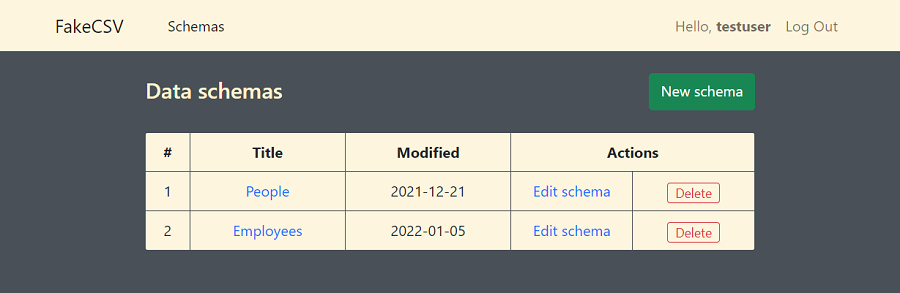
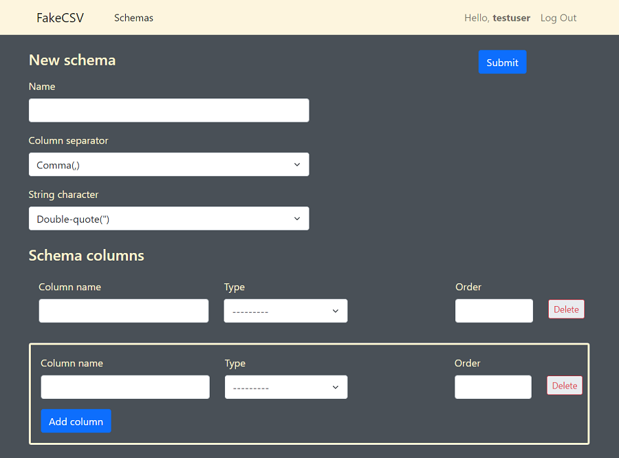
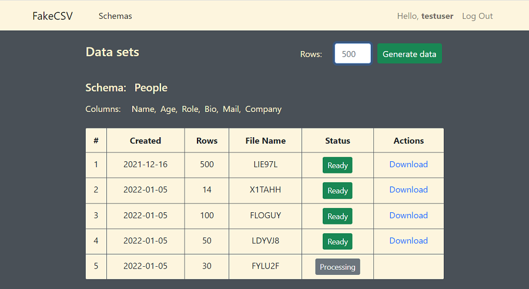

# FakeCSV

## Project Description

FakeCSV is an online service for generation of CSV files with fake(dummy) data using Python, Django and JavaScript.
Any logged-in user can create any number of schemas and, based on the selected schema, generate datasets with fake data. 



Each data schema has a name and the list of columns with names and specified data types. Users can build the schema with any number of columns. Type of data ***integer*** supports an extra (optional) argument - range of numbers. User can manage the order of columns in an  ultimate csv file adding the order of columns in the schema form.



After creation of the schema, the user can follow the link with the schema name and generate data related to that schema on "Data sets" page.



Here the user can input the number of records to appear in a csv file and download the csv file as soon as its status is "Ready" (green button).

The user can edit or delete any of its schemas. In case of deletion, all datasets related to the deleted schema will be destroyed. Each user can see only his/her own schemas and datasets.

## Distinctiveness and Complexity

This service applies some new features and technologies which were never used in the earlier projects:

1. Using Celery and Redis (as broker and result backend) to let the following processes run at background (asynchronuosly):

   *In case of dataset generation  ("**Generation Task**"):*

   - build request body for API request based on user's custom schema, 
   - request data from external API,
   - save response data as cvs file to external mediafiles storage,
   - create DataSet model object to keep records of the dataset, including the path to the saved csv file,
   - update cache records.

   *In case of deletion of the schema:*

   - remove all datasets related to the deleted schema from the mediafiles storage.

2. Processing multiform input data for a new schema. 

   The 'new schema form' on page schema.html consists of schema form itself and variable number of columns, where each column represents datatypes form.
   Columns are added to 'new schema form' with help of JavaScript function [addColumn()](schemas/static/schemas/schema.js). This function also adds an 'index' to each column's id and name attributes. When 'new schema form' is submitted, it is processed by ***post*** method of class **SchemaCreate** in views.py. This method extracts from POST dictionary the list of '*indexes*' 
   ```
   index_list = [col.split('_')[-1].strip() for col in request.POST if col.startswith('column_name')]
   ```
   
   and uses these indexes for validation of each column (SchemaTypes object) present in the input data (POST dictionary in request object).

3. Monitoring the Generation Task performance with the cached task data.
   
   The project uses Redis also to cache some data related to the Generation Task. When user submits a request for generation of a new dataset (on page *datasets.html*), the view function in charge creates so-called 'task_key' string 
   ```
   task_key = f'schema-{schema_id}.{mtk}'
   ```
   where '*mtk*' or '*monitor_task_key*' is a name of the pending csv file, and puts it to cache.
   
   As soon as the Generation Task is launched, the '*task_key*' (including '*mkt*') becomes immediately available both:
   - in ***get*** method of class **Datasets** - as accessible from cache; and 
   - in ***generate_csv*** function - as task function argument.

   ***Get*** method of class **Datasets** extracts from cache all the 'task keys and their values' related to the schema. These data (including, '*monitor_task_key*') are added to context as '*pending_data*' to distinguish '*pending_data*' (information about tasks in progress) from '*schema_data*' (information about already existing csv files). User interface shows a colored label of generation status for each dataset (processing/ready).

   In order to track the current status, JavaScript function '***statusCheck()***' calls function '***getPendingDataStatus()***' every 3 seconds. The latter function reads 'monitor_task_key' from DOM for each pending task and fetches the server to get url of csv file, if available. As soon as url of csv file is placed to the response, the interface updates the status from '*processing*' to '*ready*' and shows download link for the new csv file.  

4. Deployment on heroku

   The project is deployed on heroku and connected to Redis and Postgres heroku add-on services. Module settings.py is updated in a such way that the application may still be updated and tested locally (with use of db.sqlite3 and dockerized redis), and then may be pushed to heroku for upgrade. With help of 'django-storages' package installed, all csv files (mediafiles) are located at AWS S3 bucket.

## What is contained in each file created

   ### Root folder

   The root folder of the project consists of the project folder ***fakecsv***, application folder ***schemas*** and several files: *manage.py* (generated by Django), *README.md* (this file), *requirements.txt* (project dependencies), *.gitignore*, and two files required for deployment on heroku: *Procfile* and *runtime.txt*. The root folder of the project also includes *readme_docs* folder with some pictures and documents mentioned in this README.md file.

   ### Project folder

   The project folder ***fakecsv*** consist of usual files generated by Django (*\_\_init\_\_.py*, *settings.py*, *urls.py*, *wsgi.py*, *asgi.py*) and *celery.py*.  Configurations required by Celery are added to *celery.py*, *settings.py*, and *\_\_init\_\_.py*. *Settings.py* includes configurations for connection to databases and cache.

   ### Application folder

   The application folder ***schemas*** consist of usual files generated by Django (*\_\_init\_\_.py*, *admin.py*, *apps.py*, *models.py*, *tests.py*, *views.py*) and some other modules and folders listed in below tables.

   #### Modules: 

   | module               | description |
   | :------------------- | :-------------------------------------|
   | *urls.py*            | contains available application routes |
   | *forms.py*           | contains two form classes **SchemaForm** and **SchemaTypesForm** related to the respective model classes **Schema** and **SchemaTypes** |
   | *tasks.py*           | wraps functions ***generate_csv*** and ***delete_datasets*** into the celery tasks ***fake_csv*** and ***del_csv*** respectively |
   | *utils.py*           | defines functions ***generate_csv***, ***delete_datasets***, and ***monitor_task_key*** |

   #### Folder ***static/schemas*** includes:

   | static file          | description                            |
   | :------------------- | -------------------------------------- |
   | *styles.css*         | styles for all html pages              |
   | *alerts.js*          | JS fadeOut function for messages       |
   | *index.js*           | JS code for index.html only            |
   | *schema.js*          | JS code for schema.html only           |
   | *schema_update.js*   | JS code for schema_update.html only    |
   | *datasets.js*        | JS code for datasets.html only         |

   #### Folder ***templates/schemas*** includes:

   | template             | description                            |
   | :------------------- | -------------------------------------- |
   | *layout.html*        | base html template to be extended      |
   | *register.html*      | user registration page                 |
   | *login.html*         | user login page                        |
   | *index.html*         | main page showing all user's schemas   |
   | *schema.html*        | html form for new schema creation      |
   | *schema_update.html* | html form for update existing schema   |
   | *datasets.html*      | lists all datasets for the selected schema |
   
   #### Folder ***templates/schemas/inc*** contains snippets of the repeated html code:

   | snippet              | description                            |
   | :------------------- | -------------------------------------- |
   | *navbar.html*        | navbar, included to layout.html        |
   | *column.html*        | html form generated by SchemaTypesForm, included to schema.html |
   | *alerts.html*        | messages, included to register.html, login.html, index.html, schema.html, schema_update.html |
   

## How to run application

   Web application is already deployed on heroku and is available [here](https://fake--csv.herokuapp.com).

   Alternatively, the dockerized version of the application may be installed and run locally as follows:

   1. Create root folder `mkdir <root_folder_name>`.

   2. Go to root folder `cd <root_folder_name>`.

   3. Create project folder fakecsv `mkdir fakecsv`.

   4. Copy docker-compose.yml and .env.dev files from [readme_docs](readme_docs) folder to the root folder.

   5. Generate new Django SECRET_KEY [here](https://miniwebtool.com/django-secret-key-generator/) and add the SECRET_KEY value to .env.dev.

   6. Get API Key from [Mockaroo](https://www.mockaroo.com/) and add the MOCKAROO_API_KEY value to .env.dev.
  
   7. Being in the root folder, run in the command line `docker-compose pull`.

   8. Being in the root folder, run in the command line `docker-compose up -d`.

   9. Check if application is launched in browser at '0:0:0:0:8000' or 'localhost:8000'.

   10. In command line run `docker-compose exec web python manage.py createsuperuser`. Add you credentials.

   11. In command line run `docker-compose exec web python manage.py loaddata datatypes.json`.

   12. Web application is ready for use at '0:0:0:0:8000' or 'localhost:8000'.

   Notes:
 
   - In order to run dockerized version of fakecsv project, you should have docker installed on you local computer.

   - Replace <root_folder_name> with any arbitrary name. 

   - Dockerized version of fakecsv project is not configured for production.     


## Additional information

   Despite user interface and internal logic is absolutely the same, Dockerized version of fakecsv project is a little bit different from the deployed version as it does not use heroku add-on services and AWS S3 service for mediafiles storage. Instead it uses offical dockerhub images for redis and postgres, and stores mediafiles locally.